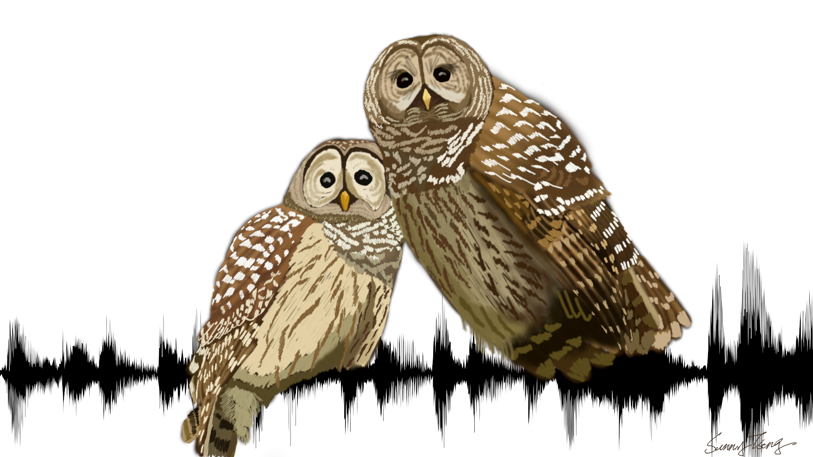
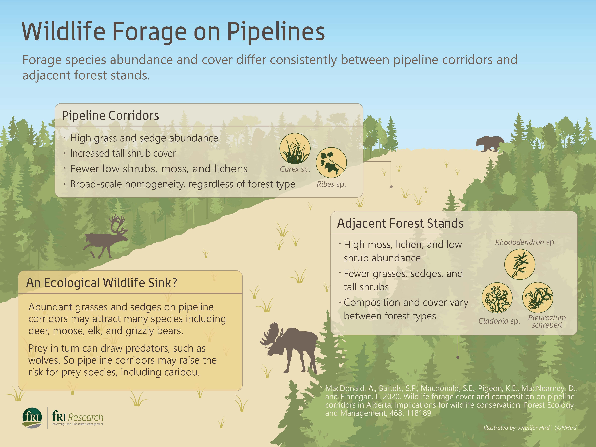

# Infographic for linear features paper

## About

The paper is entitled "Walking the line: Investigating biophysical characteristics related to wildlife use of linear features", which is published in 2023 (Tattersall et al., 2023). The goal of this project is to create an infographic for this research paper!

## Time line

| Deliverable | Due | Review |
| ----------- | ------------- | ------ |
| Content and relevant info | Feb.17 (Fri.) |  |
| Draft of design | Feb.22 (Wed.) | agree on the draft |
| Visual design | Mar.5 (Sun.) |  |
| Text design | Mar.10 (Fri.) | final review of the product |
| Final product | Mar.17 (Fri.) |  |

## Tools

I will be using these two platforms for designing: 

- [GIMP](https://www.gimp.org/): an image editor for most of the visual design, including digital drawing.

- [Canva](https://www.canva.com/): a design tool for presentations and social media. I will be using canva for the text design. 

Example of some of my previous digital drawing: 

## Expected output

- Dimension: 1920x1080 pixel (same dimension as the owl drawing above)
- Orientation: Horizental
- File type: PNG, JPEG, PDF

## Expected compensation

Between \$700 - \$800, with around 30 working hours expected for the work 

| Hours | Task |
| --- | --- |
| 4 | materials and infoormation collection |
| 5 | communication |
| 12 | visual design |
| 4 | text design |
| 3 | review and final editing of the work |
| 2 | others |

## References

- [FUSE consulting company](https://www.fuseconsulting.ca/infographics)
- [FRI research](https://friresearch.ca/search/?frisearchable_posts%5BhierarchicalMenu%5D%5Btaxonomies_hierarchical.publication_type.lvl0%5D%5B0%5D=Summaries%20and%20Communications&frisearchable_posts%5BhierarchicalMenu%5D%5Btaxonomies_hierarchical.publication_type.lvl0%5D%5B1%5D=Infographics)

